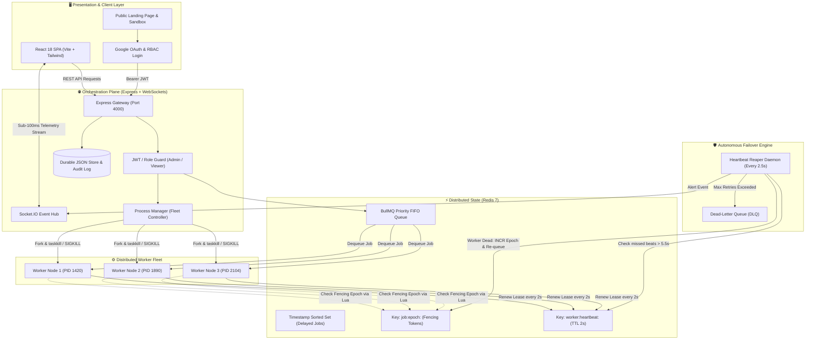
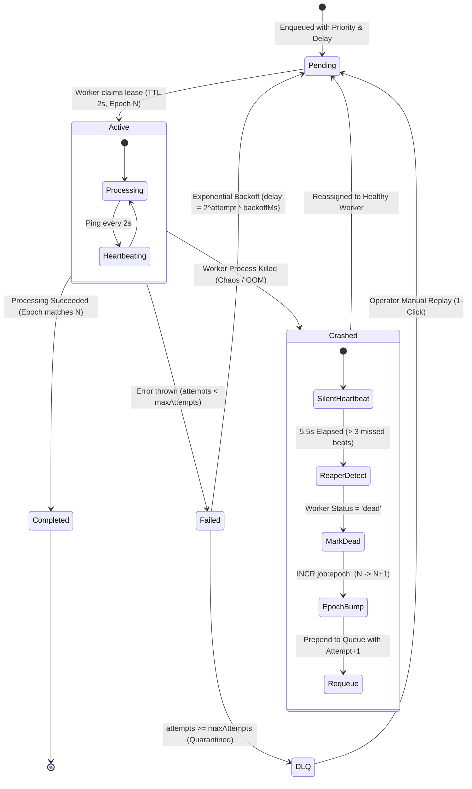

# PulseQueue ⚡
### Distributed Task Scheduler & Worker Execution Engine

[](https://www.typescriptlang.org/)
[](https://nodejs.org/)
[](https://redis.io/)
[](https://react.dev/)
[](https://tailwindcss.com/)
[](https://socket.io/)

> **High-Throughput Asynchronous Task Processing with Autonomous Failover, Distributed Leases, and Real-Time Telemetry**  
> *Engineered for the Synora Hackathon — Distributed Systems Track*

---

## 📌 1. Executive Summary & Problem Statement

Modern microservice architectures rely heavily on background asynchronous job execution for critical paths: payment processing, compliance reports, data synchronization (ETL), and webhook delivery.

### The Distributed Failure Dilemma
In high-throughput environments, worker machines crash unpredictably due to:
- **Out-of-Memory (OOM) Errors:** Large payloads causing silent process death.
- **Transient Network Partitions:** Slow responses misidentified as dead nodes.
- **Zombie Workers:** Frozen processes waking up late and writing stale results.
- **Poison Pill Tasks:** Malformed tasks that cause repeated crashes and queue starvation.

### The Solution: PulseQueue
**PulseQueue** is a resilient background job engine built on **Zero-Data-Loss Architecture**. It guarantees **At-Least-Once execution**, revokes zombie worker locks via **monotonic lease epochs**, isolates poison pills in a **Dead-Letter Queue (DLQ)** with exponential backoff, and provides **sub-100ms real-time telemetry** to an operations dashboard with a live Chaos Kill Switch.

---

## 🏗️ 2. Distributed System Architecture

The following diagram illustrates the complete end-to-end topology and lifecycle across the client, API gateway, Redis state layer, worker fleet, autonomous watchdog, and telemetry stream.



---

## 🔄 3. Failure & Recovery Lifecycle (State Machine)

The state machine below demonstrates how PulseQueue recovers orphaned tasks when a worker process crashes mid-execution:



---

## 🛡️ 4. Solving Core Distributed Systems Challenges

### 1. Zombie Worker Prevention (Monotonic Fencing Tokens)
* **The Vulnerability:** A worker experiences a prolonged Garbage Collection (GC) pause. The Reaper assumes it is dead, revokes its task, and gives it to Worker 2. Worker 1 wakes up and commits stale data to the database, causing split-brain writes.
* **Our Solution:** Every job has a Redis integer key `job:epoch:<jobId>`.
  When the Reaper reclaims a task, it executes an atomic Lua script that increments the epoch ($N \to N+1$). When Worker 1 wakes up, its completion script is rejected with:
  ```lua
  local currentEpoch = redis.call('GET', KEYS[1])
  if tonumber(currentEpoch) == tonumber(ARGV[1]) then
      redis.call('DEL', KEYS[2])
      return 1
  else
      return 0 -- REJECT STALE COMMIT
  end
  ```

### 2. Autonomous Heartbeat Reaper Daemon
* Runs every **2.5 seconds** independently of worker processes.
* Threshold: **5.5 seconds** ($\sim 3$ missed heartbeats).
* Total Failover Latency: **$< 6.0$ seconds** from instant of worker crash to task re-queuing.

### 3. Starvation Prevention & Priority Buckets
* High-priority jobs (Priority 10) are scheduled ahead of bulk jobs.
* Re-queued failover jobs are prepended to the head of their respective priority bucket to ensure timely recovery.

### 4. Exponential Backoff & Dead-Letter Queue (DLQ)
* Backoff formula: $\Delta t = \text{backoff\_ms} \times 2^{(\text{attempt} - 1)}$.
* After 3 failed attempts, poison pills are moved to the DLQ with complete error codes and stack traces.
* Operators can click **Replay** on the dashboard to safely re-inject fixed tasks.

---

## 📊 5. Core Feature Matrix

| Feature | Distributed Systems Mechanism | Value Delivered |
| :--- | :--- | :--- |
| **Monotonic Lease Epochs** | Redis atomic Lua scripts (`leaseManager.ts`) | Guaranteed prevention of zombie double-writes |
| **Heartbeat Reaper** | 2.5s sweeps, 5.5s expiration (`heartbeatReaper.ts`) | Autonomous sub-6s zero-data-loss failover |
| **Chaos Kill Switch** | Cross-platform OS `taskkill` & `SIGKILL` | Live deterministic evaluator demonstrations |
| **Real-time Telemetry** | Socket.IO WebSockets (`socket.ts`) | Sub-100ms updates for queue depth and worker health |
| **Google OAuth + RBAC** | Google Identity Services + JWT (`authService.ts`) | Admin (full control) vs Viewer (read-only telemetry) |
| **Liveness Supervisor Probe**| `GET /health/liveness` | Real-time watchdog health check for external monitors |
| **Automated Test Suite** | 8/8 automated distributed invariant tests | Deterministic test runner verifying lease transitions |

---

## 📂 6. Repository Layout

```text
Pulse_Queue/
├── backend/
│   ├── src/
│   │   ├── config/
│   │   │   ├── env.ts              # Configuration constants & timings
│   │   │   └── redis.ts            # Redis client singleton & connection pool
│   │   ├── db/
│   │   │   └── index.ts            # Durable JSON store with atomic file swapping
│   │   ├── middleware/
│   │   │   └── authMiddleware.ts   # JWT validation & RBAC guards
│   │   ├── services/
│   │   │   ├── authService.ts      # Google OAuth & 1-click evaluator tokens
│   │   │   ├── heartbeatReaper.ts  # Autonomous watchdog failover daemon
│   │   │   ├── leaseManager.ts     # Atomic Lua scripts & fencing tokens
│   │   │   ├── processManager.ts   # Worker process fleet controller & kill switch
│   │   │   └── queueService.ts     # BullMQ priority queue & DLQ engine
│   │   ├── worker/
│   │   │   └── workerRunner.ts     # Child process worker loop & IPC heartbeats
│   │   ├── testRunner.ts           # Distributed invariant automated test suite
│   │   └── server.ts               # Express API, liveness probe & Socket.IO server
│   ├── package.json
│   └── tsconfig.json
├── frontend/
│   ├── src/
│   │   ├── components/
│   │   │   ├── Navbar.tsx          # Sticky navigation, status pill & user avatar
│   │   │   ├── ProtectedRoute.tsx  # Authentication & RBAC route guard
│   │   │   └── SubmitJobModal.tsx  # Interactive job creation dialog
│   │   ├── context/
│   │   │   └── AuthContext.tsx     # Global auth state & session persistence
│   │   ├── pages/
│   │   │   ├── LandingPage.tsx     # Public landing page with failover simulator
│   │   │   ├── LoginPage.tsx       # Google Sign-in & 1-click evaluator login
│   │   │   ├── Dashboard.tsx       # Telemetry control room & throughput charts
│   │   │   ├── WorkersFleet.tsx    # Live worker matrix & chaos kill switches
│   │   │   ├── JobsList.tsx        # Filterable jobs table with DLQ filter
│   │   │   ├── JobDetail.tsx       # Step-by-step attempt histories & stack traces
│   │   │   └── AuditLogs.tsx       # Chronological cryptographic security log
│   │   ├── services/
│   │   │   ├── api.ts              # REST client with Bearer token injection
│   │   │   └── socket.ts           # WebSocket connection manager
│   │   ├── App.tsx                 # Routing & global providers
│   │   └── main.tsx
│   ├── package.json
│   ├── tailwind.config.js
│   └── vite.config.ts
├── shared/
│   └── types.ts                    # Shared TypeScript interfaces
├── infra/
│   └── redis.conf                  # Custom Redis AOF persistence config
├── README.md
└── PROJECT_OVERVIEW.md
```

---

## ⚡ 7. Quick Start & Setup Guide

### Prerequisites
1. **Node.js**: v18.0.0 or higher
2. **Redis Server**: Installed and accessible on `127.0.0.1:6379`

---

### Step 1: Start Redis Server
```powershell
redis-server
```
*(Verify Redis is listening on `127.0.0.1:6379`)*

---

### Step 2: Start Backend Server & Worker Fleet
Open a second terminal:
```powershell
cd backend
npm install
npm run dev
```
> **What happens automatically:**
> - Boots Express API and Socket.IO on `http://localhost:4000`
> - Initializes Heartbeat Reaper Daemon
> - Spawns 3 worker node processes (`worker-node-1`, `worker-node-2`, `worker-node-3`)
> - Connects to local Redis queue

---

### Step 3: Run Automated Distributed Invariant Tests
Open another terminal:
```powershell
cd backend
npm test
```
**Expected Output:**
```text
🧪 [Test Suite] Running PulseQueue Distributed Primitives Verification...
  ✅ PASS: Redis connection is operational
  ✅ PASS: Worker 1 acquired initial lease
  ✅ PASS: Initial lease epoch is 1
  ✅ PASS: Competing Worker 2 is rejected while lease is held
  ✅ PASS: Worker 1 successfully renewed active lease with current epoch
  ✅ PASS: Reaper bumped fencing epoch from 1 to 2 upon simulated failover
  ✅ PASS: Zombie worker with stale epoch 1 is REJECTED by fencing token
  ✅ PASS: Rescued worker with epoch 2 is successfully accepted and validated

📊 [Test Summary] Passed: 8, Failed: 0
```

---

### Step 4: Start Frontend Dashboard
Open another terminal:
```powershell
cd frontend
npm install
npm run dev
```
Access the application at:
👉 **[http://localhost:5173](http://localhost:5173)**

---

## 🧪 8. Live Judge Evaluation & Demo Walkthrough

When presenting to judges, follow this **3-minute live demonstration**:

1. **The Problem Showcase (Landing Page):**
   - Open `http://localhost:5173/`.
   - Scroll to the **"Live Failover & Reaper Simulator"** card.
   - Click **"Simulate Worker Crash"** to demonstrate the 3-step recovery lifecycle before entering the dashboard.

2. **Authentication & RBAC:**
   - Click **"Launch Control Plane"** $\to$ redirected to `/login`.
   - Click **"Judge / Evaluator (Admin)"** to sign in with full permissions.
   - Notice the cyan `ADMIN` badge and user profile in the top navbar.

3. **Task Ingestion:**
   - Click **"Enqueue Task"** $\to$ select **Batch Submission** $\to$ enqueue 10 tasks.
   - Watch the workers pick up tasks in parallel on the live throughput charts.

4. **The Live Chaos Kill Test:**
   - Navigate to **"Worker Fleet"** (`/workers`).
   - Find an actively processing worker node and click **"Kill Worker"**.
   - **Watch the system react in real-time:**
     - The targeted worker's PID is killed instantly via OS signal.
     - The status flips to `KILLED`.
     - In $< 5.5$ seconds, the Heartbeat Reaper logs a warning and reclaims the task.
     - The task is reassigned to another healthy worker.
     - The top counter increments: `1 recovered`.
     - The task completes with **0 data loss**.

5. **Poison Pill & Dead-Letter Queue (DLQ):**
   - Enqueue a `fault_simulation` task.
   - Observe it retry with exponential delays before safely retiring into the **Dead-Letter Queue**.
   - Navigate to `/jobs?status=dead`, inspect the exact error stack trace, and click **"Replay"** to demonstrate manual recovery.

---

## 📜 9. License
MIT License. Built for the Synora Hackathon / Distributed Systems Track.
