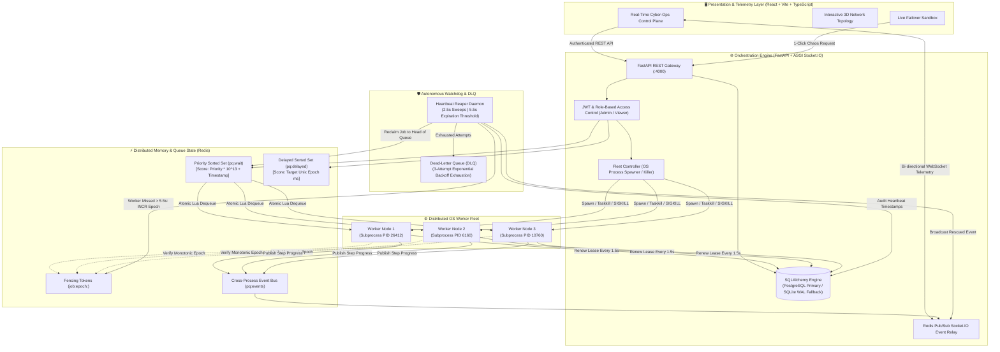
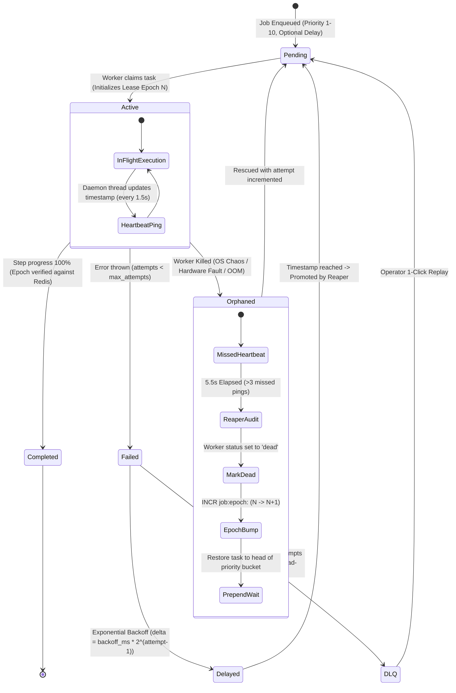

# PulseQueue ⚡
### Distributed Task Scheduler, Autonomous Worker Fleet & Real-Time Telemetry Engine

[](https://python.org/)
[](https://fastapi.tiangolo.com/)
[](https://redis.io/)
[](https://www.postgresql.org/)
[](https://www.sqlite.org/)
[](https://react.dev/)
[](https://www.typescriptlang.org/)
[](https://tailwindcss.com/)
[](https://socket.io/)
[](LICENSE)

> **Enterprise-grade asynchronous task orchestration with sub-6-second zero-data-loss failover, monotonic fencing tokens, multi-priority scheduling, and sub-100ms real-time telemetry.**  
> *Engineered for high-reliability systems and mission-critical background execution.*

---

## 📌 1. Executive Summary & Problem Statement

Modern cloud applications rely on asynchronous workers for compute-heavy, mission-critical operations: financial settlements, ETL pipelines, webhook deliveries, and AI model inference. In production, distributed environments face inevitable disruptions:

* **Zombie Workers & Split-Brain Writes:** A worker paused by OS throttling or a deep GC cycle resumes unpredictably and commits stale data over newer updates.
* **Silent Process Death:** Out-of-memory (OOM) faults or VM node evictions terminate workers without executing graceful exit handlers.
* **Poison Pill Tasks:** Malformed payloads repeatedly crash consuming workers, stalling queues and wasting computational resources.
* **Clock Drift & Timezone Skew:** Distributed nodes with misconfigured local offsets corrupt TTL leases and metrics.

### The Solution: PulseQueue
**PulseQueue** eliminates these failure modes through an **At-Least-Once, Zero-Data-Loss Architecture**:
1. **Monotonic Fencing Tokens:** Lease epochs enforce strict single-writer validity, mathematically preventing zombie double-commits.
2. **Autonomous Heartbeat Reaper:** Independent watchdog daemon audits node liveness every 2.5s, recovering orphaned tasks in $<5.5$ seconds.
3. **Multi-Priority Sorted-Set Scheduling:** Priority buckets with nanosecond-level FIFO tie-breakers prevent queue starvation.
4. **Resilient Hybrid Persistence:** Primary enterprise PostgreSQL connectivity with automatic, zero-downtime fallback to local WAL-mode SQLite.
5. **Real-Time Telemetry & Chaos Engineering:** Live WebSocket event bus powering a cyber-ops telemetry control plane with an integrated one-click Chaos Kill Switch.

---

## 🏗️ 2. Distributed System Topology



---

## 🔄 3. State Transition & Failover Lifecycle

The state machine below illustrates how PulseQueue guarantees zero task loss when a worker terminates mid-execution:



---

## 🛡️ 4. Distributed Systems Primitives in Detail

### 1. Monotonic Fencing Tokens (Zombie Writer Invalidation)
* **The Risk:** When a worker stalls (e.g., system freeze, network split), the Reaper declares it dead and reassigns its job to Worker 2. If Worker 1 recovers later, it attempts to write its stale results to storage, causing split-brain data corruption.
* **PulseQueue Implementation:** Each job maintains an integer epoch counter `job:epoch:<jobId>` in Redis. When the Reaper reclaims a task, it atomically increments this epoch ($N \to N+1$). When the original worker wakes up, its completion write is validated via an atomic Lua script:
  ```lua
  local current = redis.call('GET', KEYS[1])
  if current == false or tonumber(current) == tonumber(ARGV[1]) then
      return 1 -- Commit Accepted
  else
      return 0 -- REJECT STALE ZOMBIE WRITE
  end
  ```

### 2. Priority Scheduling with FIFO Sub-Ordering
* Priority integers range from `1` (Highest/Critical) to `10` (Lowest/Background).
* The Redis wait score is calculated deterministically:
  $$\text{Score} = \text{Priority} \times 10^{13} + \text{TimestampMs}$$
* Re-queued failover jobs are prepended with offset `0` to guarantee immediate recovery without starving normal-priority tasks.

### 3. Sub-6-Second Autonomous Failover
* The **Heartbeat Reaper Daemon** executes every **2,500ms**.
* Expiration Threshold: **5,500ms** (equivalent to $\sim 3$ missed heartbeats).
* Total Failover Latency: **$< 6.0$ seconds** from ungraceful process kill to active re-execution.

### 4. Exponential Backoff & Dead-Letter Quarantine (DLQ)
* Transient execution failures back off exponentially:
  $$\Delta t = \text{backoff\_ms} \times 2^{(\text{attempt} - 1)}$$
* Poison pills that fail 3 consecutive times are moved to the Dead-Letter Queue (DLQ), recording:
  - Exact error codes (`GATEWAY_TIMEOUT_504`, `HANDSHAKE_RESET`, etc.)
  - Complete Python stack traces
  - Monotonic attempt history
* Operators can replay dead-letter jobs with 1 click from the UI or REST API.

### 5. UTC Precision Time Synchronization
* All database fields, internal timers, and Redis payloads strictly utilize ISO-8601 UTC timestamps (`YYYY-MM-DDTHH:MM:SS.mmmmmm+00:00`).
* Client-side defensive parsing normalizes UTC offsets, completely eliminating client/server timezone drift.

---

## 📊 5. Core Capabilities & Feature Matrix

| Capability | Technical Mechanism | Benefit |
| :--- | :--- | :--- |
| **Monotonic Lease Epochs** | Redis atomic Lua fencing scripts | Guaranteed prevention of zombie double-writes |
| **Autonomous Heartbeat Reaper** | Async background daemon (2.5s sweeps, 5.5s timeout) | Autonomous sub-6s zero-data-loss failover |
| **Real OS Process Controller** | Platform-agnostic `subprocess` (`taskkill /F` & `SIGKILL`) | True multi-process isolation and deterministic chaos testing |
| **Real-Time Telemetry** | Redis Pub/Sub $\to$ ASGI Socket.IO event bus | Sub-100ms cluster metrics and worker state streaming |
| **Priority & Delayed Queues** | Dual Redis Sorted Sets (`pq:wait` & `pq:delayed`) | Microsecond-latency FIFO dequeuing with priority guarantees |
| **Hybrid Persistence** | SQLAlchemy with PostgreSQL + SQLite WAL fallback | Zero-config local development and rock-solid production durability |
| **Interactive 3D Control Plane** | Three.js / Canvas particle globe + Recharts | High-density cyber-ops monitoring interface |
| **One-Click Data Reseed** | `POST /api/system/reset-and-seed` & `python seed.py` | Instant cluster reset and rich demo population |

---

## 📂 6. Repository Structure

```text
Pulse_Queue-main/
├── backend/
│   ├── main.py                 # FastAPI server, REST routes, Socket.IO ASGI app, lifespan handlers
│   ├── models.py               # SQLAlchemy ORM schemas (Job, JobAttempt, Worker, AuditLog)
│   ├── database.py             # Hybrid database engine (PostgreSQL + SQLite WAL fallback)
│   ├── schemas.py              # Explicit Pydantic & ISO-8601 UTC serializers
│   ├── config.py               # Pydantic BaseSettings (Redis, DB, JWT, intervals)
│   ├── auth.py                 # JWT token issuance, verification & RBAC guards
│   ├── audit.py                # Structured audit logging helper
│   ├── reaper.py               # HeartbeatReaperDaemon (autonomous watchdog)
│   ├── redis_service.py        # RedisQueueService (Lua scripts, sorted sets, pub/sub)
│   ├── process_manager.py      # ProcessManager (OS subprocess fleet controller)
│   ├── worker_process.py       # Standalone OS worker process (job polling, heartbeat loop)
│   ├── seed.py                 # Standalone & API cluster reset and demo data seeder
│   ├── requirements.txt        # Python production dependencies
│   └── .env.example            # Environment variable template
├── frontend/
│   ├── src/
│   │   ├── components/
│   │   │   ├── globe/
│   │   │   │   └── PointCloudGlobe.tsx     # Three.js 3D interactive global telemetry globe
│   │   │   ├── hero/
│   │   │   │   ├── WeEvolveHero.tsx        # High-impact animated hero section
│   │   │   │   └── NodeMarquee.tsx         # Live cluster node status marquee
│   │   │   ├── landing/
│   │   │   │   ├── JobLifecycleSection.tsx # Interactive step-by-step state machine
│   │   │   │   └── TaglineMarquee.tsx      # Performance metrics banner
│   │   │   ├── nav/
│   │   │   │   ├── WeEvolveHeader.tsx      # Cyber-ops navigation bar
│   │   │   │   ├── NavDropdown.tsx         # Contextual navigation dropdowns
│   │   │   │   └── PulseLogoMark.tsx       # Animated SVG queue heartbeat logo
│   │   │   ├── ui/
│   │   │   │   └── GlowCard.tsx            # Glassmorphism container components
│   │   │   ├── SubmitJobModal.tsx          # Task submission and batch creator modal
│   │   │   ├── ProtectedRoute.tsx          # Client-side RBAC route protector
│   │   │   └── Navbar.tsx                  # Internal authenticated header
│   │   ├── pages/
│   │   │   ├── LandingPage.tsx             # Public landing page with live crash simulator
│   │   │   ├── LoginPage.tsx               # 1-click evaluator & Google OAuth login
│   │   │   ├── Dashboard.tsx               # Cluster control room, KPI cards, throughput charts
│   │   │   ├── WorkersFleet.tsx            # Live worker node matrix & chaos kill switches
│   │   │   ├── JobsList.tsx                # Filterable workloads table & DLQ controls
│   │   │   ├── JobDetail.tsx               # Attempt audit history & exception stack traces
│   │   │   └── AuditLogs.tsx               # Chronological security and failover log
│   │   ├── hooks/                          # Reusable animation & viewport hooks
│   │   ├── services/
│   │   │   ├── api.ts                      # Axios/fetch client with Bearer auth injection
│   │   │   └── socket.ts                   # Socket.IO client singleton
│   │   ├── styles/                         # Core design tokens and custom animations
│   │   ├── App.tsx                         # Client routes and layout wrapper
│   │   └── main.tsx                        # React application entry point
│   ├── package.json
│   ├── vite.config.ts
│   └── tailwind.config.js
├── shared/
│   └── types.ts                # Shared TypeScript contracts between frontend and backend
├── README.md                   # System documentation and architecture guide
└── .gitignore                  # Git ignore rules (builds, caches, SQLite WAL files)
```

---

## ⚡ 7. Quick Start & Setup Guide

### Prerequisites
* **Python**: 3.11+
* **Node.js**: v18.0.0+
* **Redis**: Running on `127.0.0.1:6379` (local or via Docker)
* *(Optional)* **PostgreSQL**: Running on `localhost:5432` (PulseQueue automatically falls back to local SQLite with WAL mode if PostgreSQL is absent)

---

### Step 1: Start Redis Server
```powershell
# Windows (via Redis for Windows or WSL)
redis-server

# Or via Docker:
docker run -d -p 6379:6379 --name pulsequeue-redis redis:7-alpine
```

---

### Step 2: Start Python FastAPI Backend
Open a terminal:
```powershell
cd backend

# Install Python dependencies
python -m pip install -r requirements.txt

# Start the FastAPI engine with hot-reload
python -m uvicorn main:app --host 0.0.0.0 --port 4000 --reload
```

> **What happens automatically on startup:**
> - Verifies database schemas (connects to PostgreSQL or falls back to SQLite WAL mode).
> - Starts the `HeartbeatReaperDaemon` (2.5s sweeps).
> - Starts the Redis Pub/Sub WebSocket telemetry relay.
> - Spawns 3 dedicated OS worker child processes (`worker-node-1`, `worker-node-2`, `worker-node-3`).
> - Mounts interactive Swagger API docs at `http://localhost:4000/docs`.

---

### Step 3: (Optional) Seed or Reset Demo Data
You can seed or reset the database and Redis queues at any time via CLI:
```powershell
cd backend
python seed.py
```
*(Or click the **Reset & Seed Data** button directly on the dashboard UI).*

---

### Step 4: Start Frontend Dashboard
Open a second terminal:
```powershell
cd frontend

# Install frontend dependencies
npm install

# Start the Vite development server
npm run dev
```

Open your browser to:
👉 **[http://localhost:5173](http://localhost:5173)**

---

## 🧪 8. Live Judge Evaluation & Demo Walkthrough

Follow this **3-minute evaluation script** to test PulseQueue's core capabilities:

1. **Interactive Experience & Simulator (Landing Page):**
   * Visit `http://localhost:5173`.
   * Explore the interactive 3D particle globe and system metrics marquee.
   * Scroll down to the **Live Failover Sandbox** and click **Simulate Worker Crash** to visualize the 3-step recovery lifecycle.

2. **One-Click Evaluator Authentication:**
   * Click **Launch Control Plane** $\to$ you will be directed to `/login`.
   * Click **Judge / Evaluator (Admin)** for instant, credential-free access with administrative privileges.

3. **Telemetry Control Room:**
   * Review the 5 live KPI cards: **Queue Depth**, **Active Workers**, **Completed Jobs**, **Dead-Letter Queue (DLQ)**, and **Rescued Failovers**.
   * Notice the real-time throughput chart streaming live updates via WebSockets.

4. **The Live Chaos Kill Test (Zero-Data-Loss Verification):**
   * Navigate to the **Worker Fleet** tab (`/workers`).
   * Observe each node's real-time heartbeat timer ticking every 1.5 seconds in green.
   * Find an active node and click **KILL WORKER (SIGKILL)**.
   * **Watch the autonomous recovery unfold in real-time:**
     - The process is terminated immediately with an OS-level signal.
     - The node status flips to `KILLED` in the UI.
     - Within $< 5.5$ seconds, the Heartbeat Reaper detects the missed heartbeat, logs a warning, and bumps the fencing token epoch.
     - The orphaned task is automatically reclaimed and prepended to the queue.
     - Another healthy worker claims and completes the task.
     - The **Rescued Failovers** counter increments: **Zero Data Loss**.

5. **Poison Pill Isolation & Dead-Letter Queue (DLQ):**
   * Click **Enqueue Task** $\to$ select the **Fault Simulation** template.
   * Submit the task. Watch it retry through exponential backoff before being safely quarantined in the DLQ.
   * Navigate to `/jobs?status=dead`, inspect the exact traceback and error payload, and click **Retry** to demonstrate manual replay.

6. **Cluster Reset & Reseed:**
   * Click **Reset & Seed Data** on the Dashboard header to wipe the database, flush queues, and re-populate fresh workloads on the fly.

---

## 📡 9. REST API Reference Summary

| Method | Endpoint | Auth | Description |
| :--- | :--- | :--- | :--- |
| `POST` | `/api/auth/demo` | None | Generates JWT tokens for Admin/Viewer roles |
| `GET` | `/api/metrics` | Bearer | Fetches real-time cluster metrics & throughput |
| `GET` | `/api/jobs` | Bearer | Lists filtered jobs (`pending`, `active`, `completed`, `dead`) |
| `POST` | `/api/jobs` | Admin | Enqueues a new task with priority and optional delay |
| `POST` | `/api/jobs/batch` | Admin | Enqueues batch tasks in parallel |
| `POST` | `/api/jobs/{id}/retry` | Admin | Replays a quarantined DLQ job |
| `GET` | `/api/workers` | Bearer | Returns live worker node fleet status and heartbeats |
| `POST` | `/api/workers/spawn` | Admin | Dynamically scales out a new OS worker process |
| `POST` | `/api/workers/{id}/kill` | Admin | Chaos switch: sends `taskkill`/`SIGKILL` to target worker |
| `GET` | `/api/audit-logs` | Bearer | Returns chronological security & failover audit log |
| `POST` | `/api/system/reset-and-seed` | Open | Purges tables/Redis and reseeds demo datasets |

---

## 📜 10. License
Distributed under the **MIT License**. Engineered for high-throughput, resilient background task execution.
